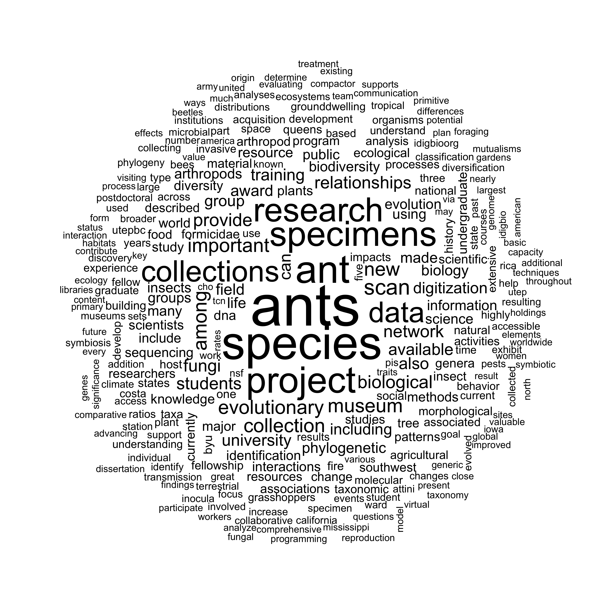
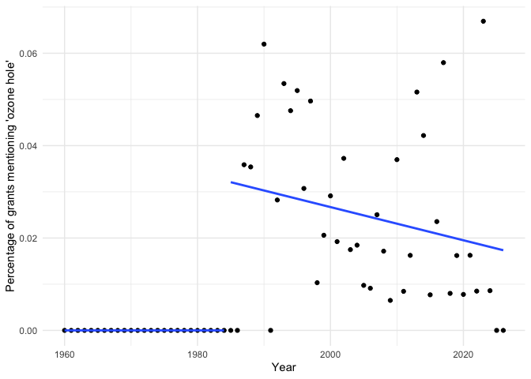
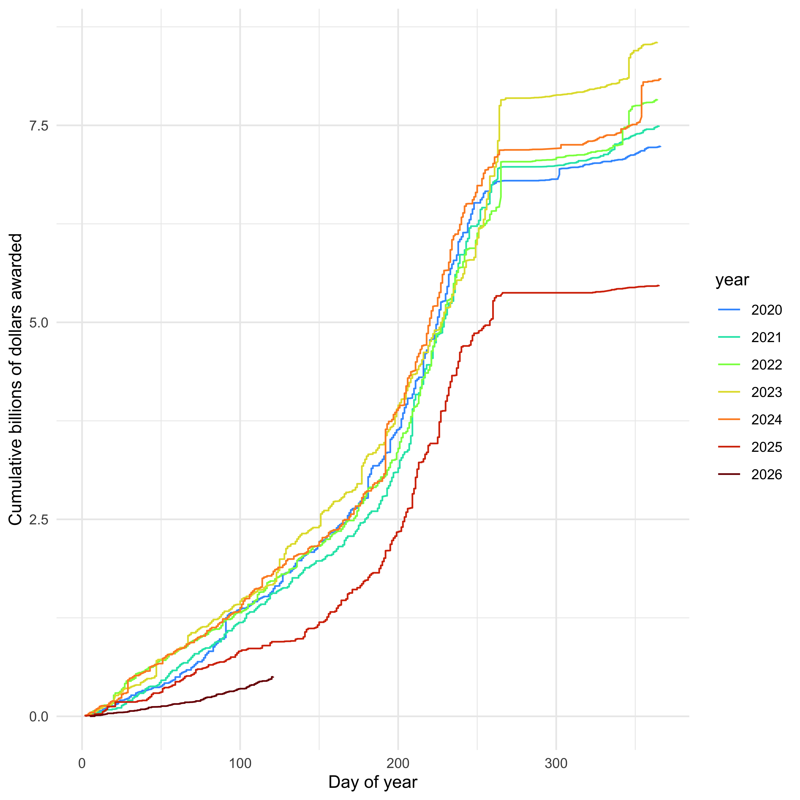
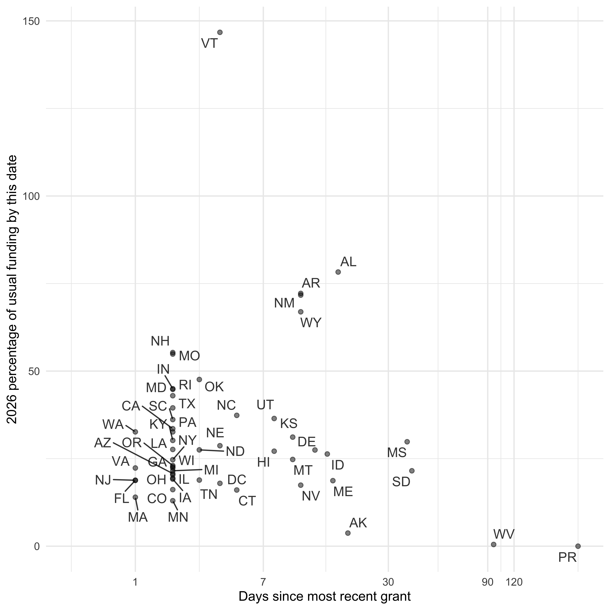
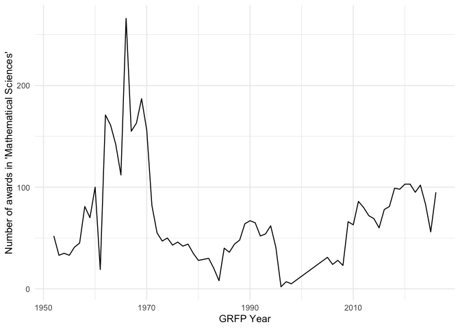

<!-- README.md is generated from README.Rmd. Please edit that file -->

# rnsf

Unofficial package to interface with NSF API

It also has abstracts, dates, and more information for all grants up to
2026-05-01.

- Webpage with package information: <https://bomeara.github.io/rnsf/>
- Github page: <https://github.com/bomeara/rnsf/>

# Installation

This package has a huge (\>500 MB) R data file containing all the cached
grant info (abstracts, money, institutions, etc.). I have stored it as a
[git large file storage file](https://git-lfs.com) inside `data`. Thus,
the usual approach to installing from github won’t work as the data
won’t be loaded in the correct way. Instead, from a terminal or command
line, on a computer with git and git-lfs installed, you will have to:

`git clone https://github.com/bomeara/rnsf.git` (note this is in your
computer terminal, not an R session!)

and then use `R CMD INSTALL rnsf` to install the package (or, from
within R, `devtools::install('rnsf')` or whatever the path is to the
directory you have cloned).

If someone wants to make an easier way to do this, please reach out!

# Examples

## Getting cached data

This package caches data on over 500,000 funded NSF grants (it’s large,
which is why the package will take a while to install, and why it will
never be on CRAN with its 5 MB maximum size). You can use it.

    library(rnsf)
    data(grants)

This will give you a data.frame with all data: `head(grants)`

It has multiple date fields which are in “%m/%d/%Y” format (but
everything is stored as a raw list, leaving to the user to process it).

## New search

You can also do a new search. For example, to get all info on ants:

``` r
library(rnsf)
ants <- rnsf::nsf_return(keyword="Formicidae")
#> [1] "Finished first batch"
```

# Visualization

## Wordcloud

There is a function for doing a wordcloud:

``` r
library(rnsf)
nsf_wordcloud(ants$abstractText)
```



## Topic frequency over time

The ozone hole was discovered in
[1985](https://www.usatoday.com/story/news/nation/2025/05/19/what-happened-to-the-hole-in-the-ozone-layer/83644470007/):
pollution led to a depletion of the ozone layer, which shields people
(and other organisms) from a great deal of UV radiation. The world came
together and passed the Montreal Protocol to limit the pollution,
chlorofluorocarbons, that was causing the damage. The hole is healing,
but still requires research and monitoring. We can see how NSF grants
mentioning “ozone hole” changed over time (though not all grants
mentioning “ozone hole” study this issue; some could be using it as a
comparison to some other issue, for example). We can include a
regression before and after 1985 and show the 95% CI for the proportion
in each year (truncated by the y-axis limits).

``` r
library(rnsf)
library(ggplot2)
library(timeDate)
library(dplyr)
#> 
#> Attaching package: 'dplyr'
#> The following objects are masked from 'package:stats':
#> 
#>     filter, lag
#> The following objects are masked from 'package:base':
#> 
#>     intersect, setdiff, setequal, union
library(viridis)
#> Loading required package: viridisLite
library(binom)

data(grants) # or use grants <- rnsf::nsf_get_all() to get the most current list (will take hours) or grants <- nsf_update_cached() to update from the last cached version

grants$ozone_hole <- grepl("ozone hole", grants$abstractText, ignore.case=TRUE)
grants$date <- as.Date(grants$date, format="%m/%d/%Y")
grants$year <- as.numeric(format(grants$date, "%Y"))

grants_by_year <- grants |> group_by(year) |> summarize(ozone = sum(ozone_hole), all = n())  |> ungroup()
grants_by_year$ozone_percent <- 100 * grants_by_year$ozone / grants_by_year$all
grants_by_year$ozone_lower_percent <- 100 * binom::binom.confint(x=grants_by_year$ozone, n=grants_by_year$all, method="exact")$lower
grants_by_year$ozone_upper_percent <- 100 * binom::binom.confint(x=grants_by_year$ozone, n=grants_by_year$all, method="exact")$upper
grants_by_year$ozone_upper_percent_truncated <- sapply(grants_by_year$ozone_upper_percent, min, 2*max(grants_by_year$ozone_percent))
g <- ggplot(grants_by_year, aes(x=year, y=ozone_percent, group=1))+ geom_errorbar(aes(ymin=ozone_lower_percent, ymax=ozone_upper_percent_truncated), colour="gray", alpha=0.4, width=0) + geom_point() + theme_minimal() + xlab("Year") + ylab("Percentage of grants mentioning 'ozone hole'") + geom_smooth(data=subset(grants_by_year, year<1985), se=FALSE, method="lm") + geom_smooth(data=subset(grants_by_year, year>=1985), se=FALSE, method="lm")  + ylim(c(0, 2*max(grants_by_year$ozone_percent)))
print(g)
#> `geom_smooth()` using formula = 'y ~ x'
#> `geom_smooth()` using formula = 'y ~ x'
```



## Bergogram

We can plot funding over time, inspired by (but not endorsed by) Jeremy
Berg’s graphs on federal funding (see
<https://jeremymberg.github.io/jeremyberg.github.io/>). Also see
<https://grant-witness.us/funding_curves.html#nsf-graphs> from Grant
Witness.

``` r
grants$date <- as.Date(grants$date, format="%m/%d/%Y")
grants$year <- format(grants$date, "%Y")
grants$dayofyear <- timeDate::dayOfYear(timeDate::timeDate(grants$date))
grants$estimatedTotalAmt <- as.numeric(grants$estimatedTotalAmt)
grants <- grants |> arrange(year, dayofyear) |> group_by(year) |> mutate(estimatedTotalAmt_by_year = cumsum(estimatedTotalAmt)) |> ungroup()
grants <- grants[!is.na(grants$year),]
grants_recent <- subset(grants, year>=2020)
g <- ggplot(grants_recent, aes(x=dayofyear, y=estimatedTotalAmt_by_year/1e9, colour=year)) + geom_line() + theme_minimal() + xlab("Day of year") + ylab("Cumulative billions of dollars awarded") + scale_colour_viridis_d(option="turbo", begin=0.2)
print(g)
```



## Table of award info

We can also look at a table with the number, not total money, of grants
by state or territory by academic semester, for example (only including
this year up to the last cache of the data).

``` r
library(tidyr)
library(knitr)

data(grants)
grants$awardeeStateCode <- toupper(grants$awardeeStateCode) # handle some early data that uses lowercase
grants$academic_semester <- rnsf::date_to_academic_semester(as.Date(grants$date, format="%m/%d/%Y"))
grants_aggregated <- grants |> filter(academic_semester %in% apply(expand.grid(c(2024:2026), c(" Fall", "  Spring")), 1, paste0, collapse="")) |> group_by(academic_semester, awardeeStateCode) |> summarise(total_awarded = n(), .groups = "drop_last") |> ungroup() |> tidyr::pivot_wider(names_from = academic_semester, values_from=total_awarded, values_fill=0) |> dplyr::arrange(desc(`2024 Fall`))
colnames(grants_aggregated) <- gsub("  ", " ", colnames(grants_aggregated))
colnames(grants_aggregated)[1] <- "Area"
grants_aggregated[,1] <- rnsf::abbreviation_to_state(unname(unlist(grants_aggregated[,1])))
knitr::kable(grants_aggregated)
```

| Area | 2024 Spring | 2024 Fall | 2025 Spring | 2025 Fall | 2026 Spring |
|:---|---:|---:|---:|---:|---:|
| California | 508 | 752 | 361 | 586 | 120 |
| New York | 371 | 475 | 256 | 371 | 74 |
| Texas | 324 | 415 | 224 | 355 | 73 |
| Massachusetts | 327 | 410 | 189 | 305 | 34 |
| Pennsylvania | 243 | 282 | 165 | 233 | 55 |
| Illinois | 218 | 277 | 122 | 224 | 33 |
| Virginia | 161 | 227 | 89 | 139 | 28 |
| Florida | 184 | 225 | 105 | 179 | 47 |
| Michigan | 208 | 215 | 97 | 188 | 34 |
| North Carolina | 153 | 210 | 103 | 181 | 31 |
| Colorado | 111 | 183 | 73 | 146 | 16 |
| Arizona | 101 | 177 | 65 | 99 | 18 |
| Georgia | 137 | 171 | 78 | 147 | 22 |
| Indiana | 130 | 166 | 83 | 157 | 31 |
| Maryland | 118 | 147 | 79 | 129 | 42 |
| New Jersey | 123 | 146 | 90 | 138 | 25 |
| Washington | 97 | 144 | 68 | 106 | 22 |
| Ohio | 110 | 134 | 73 | 106 | 21 |
| Tennessee | 78 | 108 | 41 | 83 | 13 |
| Alabama | 63 | 105 | 51 | 74 | 20 |
| Wisconsin | 76 | 105 | 64 | 91 | 19 |
| South Carolina | 60 | 102 | 31 | 66 | 19 |
| District of Columbia | 51 | 101 | 42 | 55 | 15 |
| Minnesota | 79 | 101 | 47 | 62 | 11 |
| Rhode Island | 66 | 84 | 46 | 71 | 25 |
| Oregon | 68 | 83 | 41 | 65 | 10 |
| Iowa | 54 | 77 | 36 | 66 | 9 |
| Louisiana | 54 | 77 | 30 | 68 | 14 |
| Utah | 44 | 77 | 35 | 65 | 14 |
| Missouri | 74 | 76 | 64 | 63 | 24 |
| Connecticut | 66 | 63 | 52 | 66 | 10 |
| New Mexico | 34 | 62 | 21 | 38 | 10 |
| Oklahoma | 42 | 59 | 23 | 51 | 13 |
| Kansas | 29 | 58 | 14 | 34 | 13 |
| Nebraska | 39 | 55 | 22 | 44 | 7 |
| Hawaii | 15 | 53 | 16 | 28 | 8 |
| Kentucky | 36 | 51 | 28 | 40 | 7 |
| Delaware | 18 | 47 | 31 | 37 | 6 |
| Idaho | 16 | 43 | 16 | 31 | 5 |
| Nevada | 12 | 43 | 11 | 31 | 3 |
| New Hampshire | 21 | 36 | 21 | 35 | 4 |
| Mississippi | 38 | 35 | 19 | 35 | 3 |
| Alaska | 10 | 32 | 4 | 19 | 2 |
| Montana | 19 | 32 | 8 | 22 | 4 |
| Maine | 30 | 27 | 10 | 24 | 2 |
| Arkansas | 27 | 25 | 10 | 26 | 6 |
| West Virginia | 28 | 25 | 8 | 26 | 1 |
| South Dakota | 20 | 22 | 17 | 17 | 1 |
| Vermont | 13 | 22 | 12 | 13 | 5 |
| Puerto Rico | 7 | 20 | 9 | 14 | 0 |
| Wyoming | 10 | 19 | 7 | 18 | 3 |
| North Dakota | 11 | 12 | 9 | 21 | 5 |
| Virgin Islands of the U.S. | 0 | 3 | 1 | 1 | 0 |
| American Samoa | 0 | 1 | 0 | 0 | 0 |
| Guam | 0 | 0 | 2 | 1 | 0 |

## Recent info

We can see when the most recent grant has been awarded (relative to when
this package was last built) by state or territory; we can also look to
see how funding so far this year compares to average funding at this
point of the year for 2017-2024 (so it encompasses two different
administrations).

``` r
library(lubridate)
#> 
#> Attaching package: 'lubridate'
#> The following objects are masked from 'package:base':
#> 
#>     date, intersect, setdiff, union
library(ggrepel)

data(grants)

current_day_of_year <- lubridate::yday(Sys.Date())
grants_modified <- grants
grants_modified$awardeeStateCode <- toupper(grants_modified$awardeeStateCode) # handle some early data that uses lowercase
grants_modified$date_formatted <- as.Date(grants_modified$date, format="%m/%d/%Y")
grants_modified <- grants_modified[!is.na(grants_modified$date_formatted),]
grants_modified$day_of_year <- lubridate::yday(grants_modified$date_formatted)
grants_modified$year <- as.numeric(format(grants_modified$date_formatted, "%Y"))
grants_modified$funds <- as.numeric(grants_modified$fundsObligatedAmt)
grants_recent <- grants_modified |> group_by(awardeeStateCode) |> summarize(most_recent = max(date_formatted), days_since_grant = Sys.Date() - max(date_formatted))

grants_2026 <- subset(grants_modified, year==2026)
grants_2017_2024 <- subset(grants_modified, year>= 2017 & year <=2024) # so we have 8 years of data across two admins
grants_2017_2024 <- subset(grants_2017_2024, day_of_year < current_day_of_year) # so we compare similar
grants_aggregated_2026 <- grants_2026 |> group_by(awardeeStateCode) |> summarize(funds_per_year_2026 = sum(funds)) |> arrange(awardeeStateCode) |> ungroup()
grants_aggregated_2017_2024 <- grants_2017_2024 |> group_by(awardeeStateCode) |> summarize(funds_per_year_8 = sum(funds)/8) |> arrange(awardeeStateCode) |> ungroup()
grants_comparison <- full_join(full_join(grants_aggregated_2017_2024, grants_aggregated_2026), grants_recent)
#> Joining with `by = join_by(awardeeStateCode)`
#> Joining with `by = join_by(awardeeStateCode)`
grants_comparison$funds_per_year_2026[is.na(grants_comparison$funds_per_year_2026)] <- 0
grants_comparison <- subset(grants_comparison, !is.na(grants_comparison$funds_per_year_8)) # rarely get funding
grants_comparison <- subset(grants_comparison, grants_comparison$funds_per_year_8>50000) # eliminate entities which have traditionally low, rare funding as they make it hard to see the wait times for the others 
grants_comparison$percentage_usual_funding_by_this_date <- 100*grants_comparison$funds_per_year_2026 / grants_comparison$funds_per_year_8
grants_comparison$days_since_grant <- as.numeric(grants_comparison$days_since_grant)
g <- ggplot(grants_comparison, aes(x=days_since_grant, y=percentage_usual_funding_by_this_date, label=awardeeStateCode)) + geom_text_repel(max.overlaps=50, alpha=0.8) + theme_minimal() + xlab("Days since most recent grant") + ylab("2026 percentage of usual funding by this date") + geom_point(alpha=0.5) + scale_x_continuous(trans='log1p', breaks=c(1, 7, 30, 90, 120, 365, 2*365), limits=c(0, NA)) 
print(g)
```



## GRFP data

The [NSF Graduate Research Fellowship Program](https://www.nsfgrfp.org)
(GRFP) is one of NSF’s oldest and most impactful programs: it provides
funding for three years of study for people in grad school, giving them
flexibility (no need for a research or teaching assistantship); the
stipends are also often higher than those for most grad students. Every
year, names, affiliations, and research areas of awardees (those
receiving the money) and those with honorable mentions are released
[here](https://www.research.gov/grfp/AwardeeList.do?method=loadAwardeeList)
but you can only get one year at a time. I have manually downloaded them
all and incorporated them into the package. To use:

``` r
library(rnsf)
data(grfp)
```

You can then plot information or do other analyses. For example, the
number of awards in Mathematical Sciences over time:

``` r
grfp_math <- grfp[grepl("Mathematical Sciences", grfp$Field.of.Study),] |> subset(award_level=="Awardee")
grfp_math$year <- as.numeric(grfp_math$year)
grfp_math_by_year <- grfp_math |> group_by(year) |> summarize(count=n()) |> ungroup()
g <- ggplot(grfp_math_by_year, aes(x=year, y=count, group=1)) + geom_line() + theme_minimal() + xlab("GRFP Year") + ylab("Number of awards in 'Mathematical Sciences'")
print(g)
```



And the frequency of different subfields of math, showing just the first
twenty from the past ten years of awards:

``` r
library(stringr)
subfields <- stringr::str_to_title(gsub("Mathematical Sciences - ", "", grfp_math$Field.of.Study))
popularity <- t(t(sort(table(subfields), decreasing=TRUE)))
knitr::kable(head(popularity, 20))
```

|                                                          |     |
|:---------------------------------------------------------|----:|
| Algebra Or Number Theory                                 | 786 |
| Analysis                                                 | 758 |
| Mathematical Sciences                                    | 539 |
| Topology                                                 | 466 |
| Applications Of Mathematics (Including Biometrics And Bi | 465 |
| Algebra, Number Theory, And Combinatorics                | 359 |
| Applied Mathematics                                      | 239 |
| Probability And Statistics                               | 227 |
| Logic Or Foundations Of Mathematics                      | 172 |
| Geometry                                                 | 139 |
| Statistics                                               | 131 |
| Mathematical Biology                                     |  84 |
| Operations Research                                      |  76 |
| Biostatistics                                            |  70 |
| Computational Mathematics                                |  51 |
| Geometric Analysis                                       |  37 |
| Probability                                              |  31 |
| Computational And Data-Enabled Science                   |  25 |
| Artificial Intelligence                                  |  16 |
| Computational Statistics                                 |  16 |

# Updating the package

First, update the package version in the DESCRIPTION.

Then the directory containing the package source:

    library(rnsf)
    grants <- nsf_update_cached_this_year() # perhaps worth doing a new nsf_get_all() after the beginning of the year
    usethis::use_data(grants, overwrite=TRUE) 
    devtools::install()

Then quit R and reopen (so it uses the latest saved grants).

Then:

    library(rnsf)
    devtools::build_readme()
    pkgdown::build_site()
    system("git add */*")
    system("git commit -m'automatic update of page and data' -a")
    system("git push")

If new GRFP results are out, download them, retitle them as Awardee or
HonorableMention with year and .tsv (i.e., “Awardee2030.tsv”) and put
them in the inst/extdata directory in the package source. Reinstall the
package. Then,

    library(rnsf)
    grfp <- compile_grfp()
    usethis::use_data(grfp, overwrite=TRUE)

Then do the usual git things.
