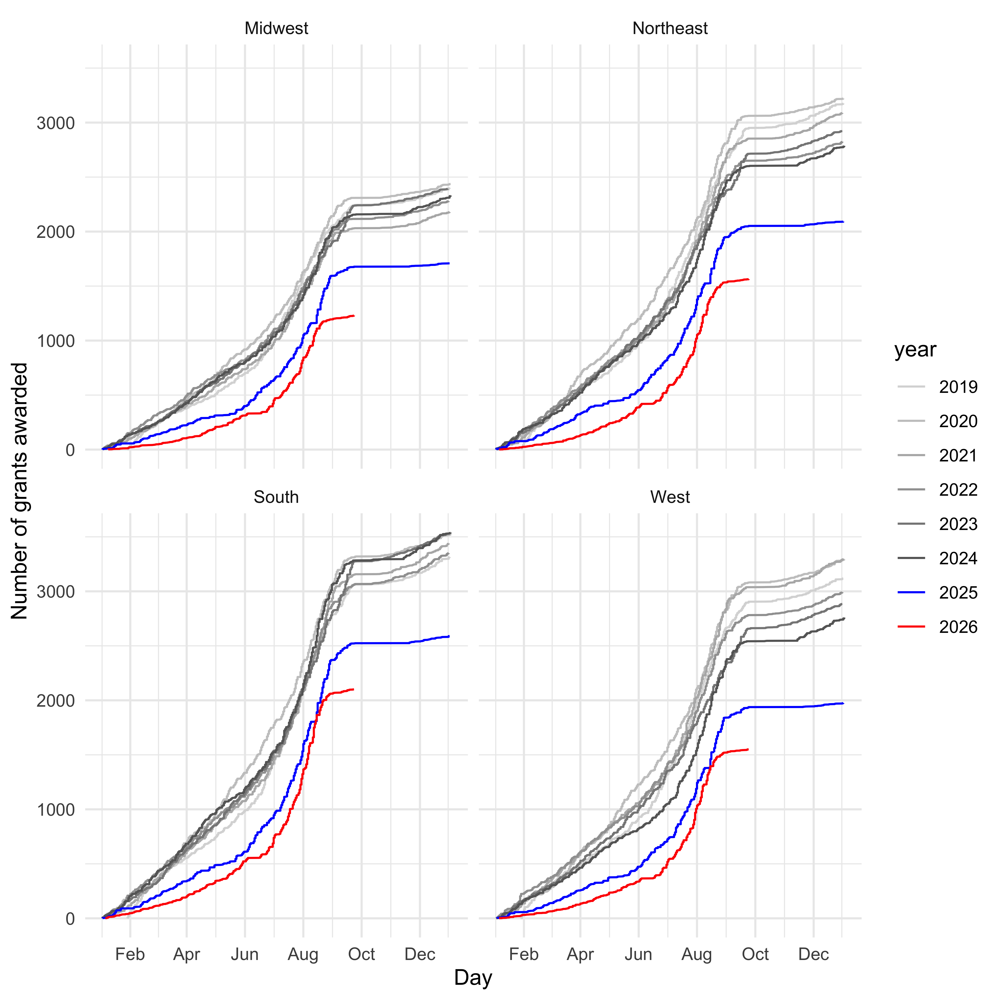
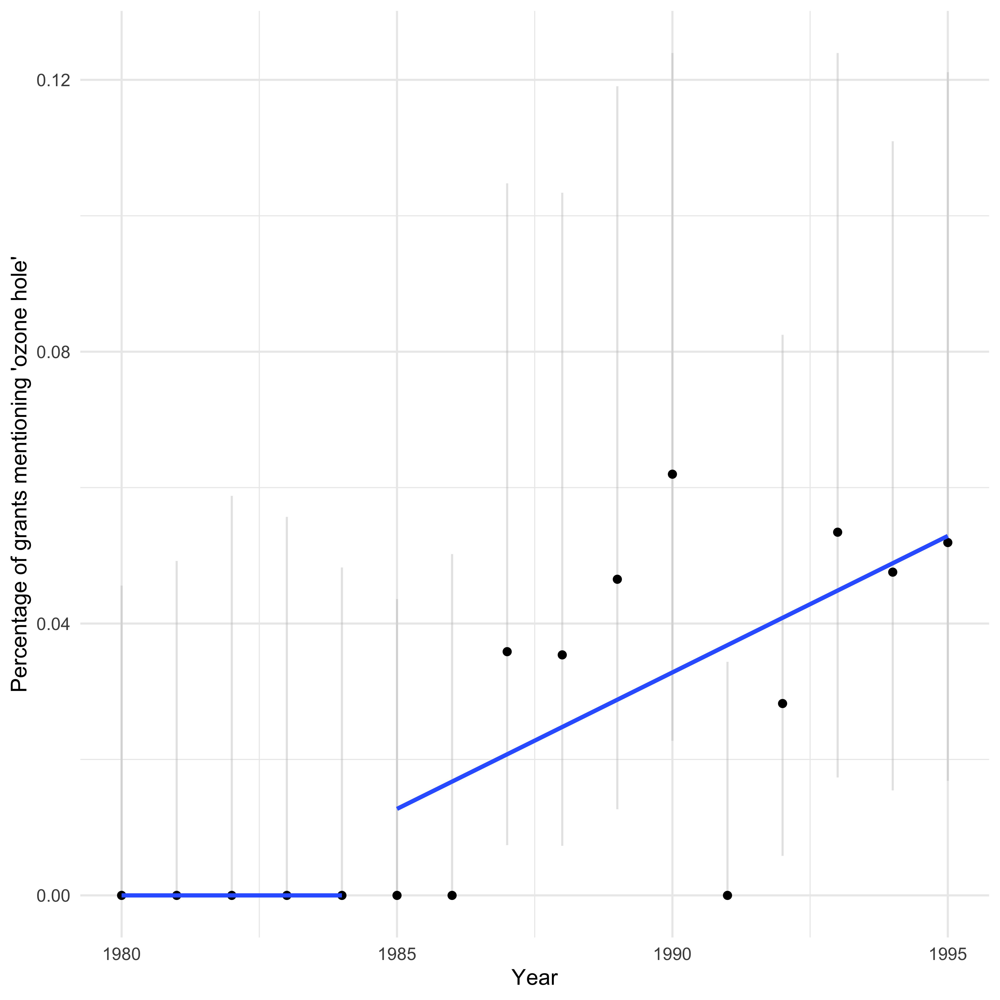
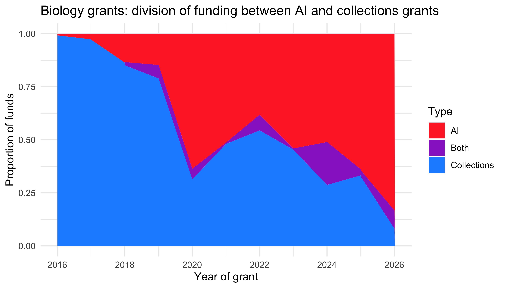
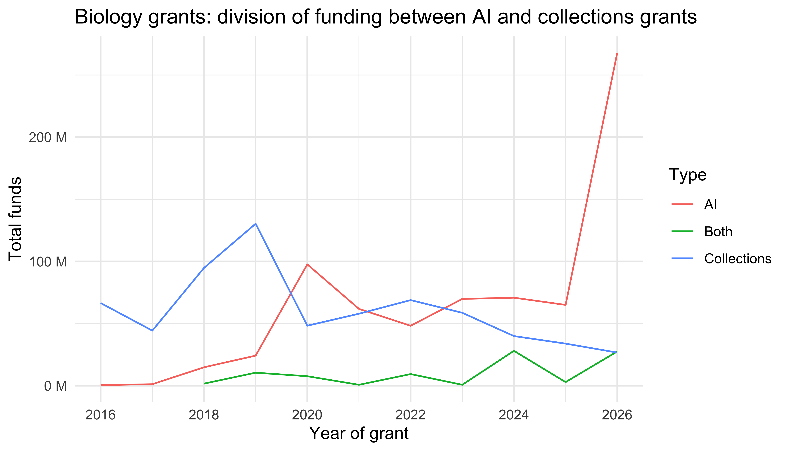
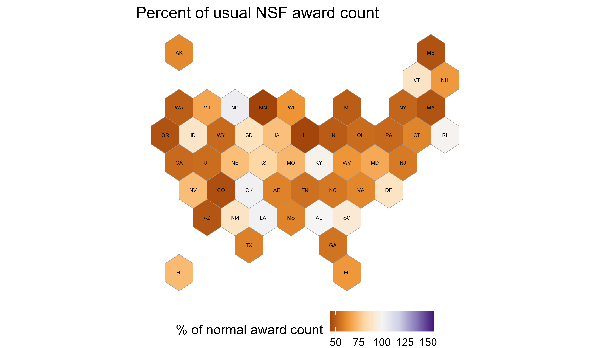
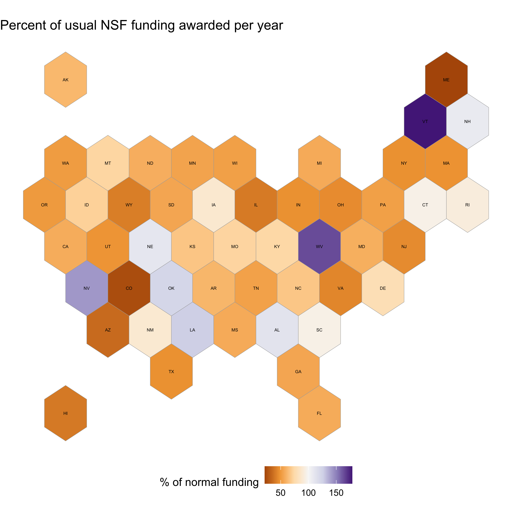
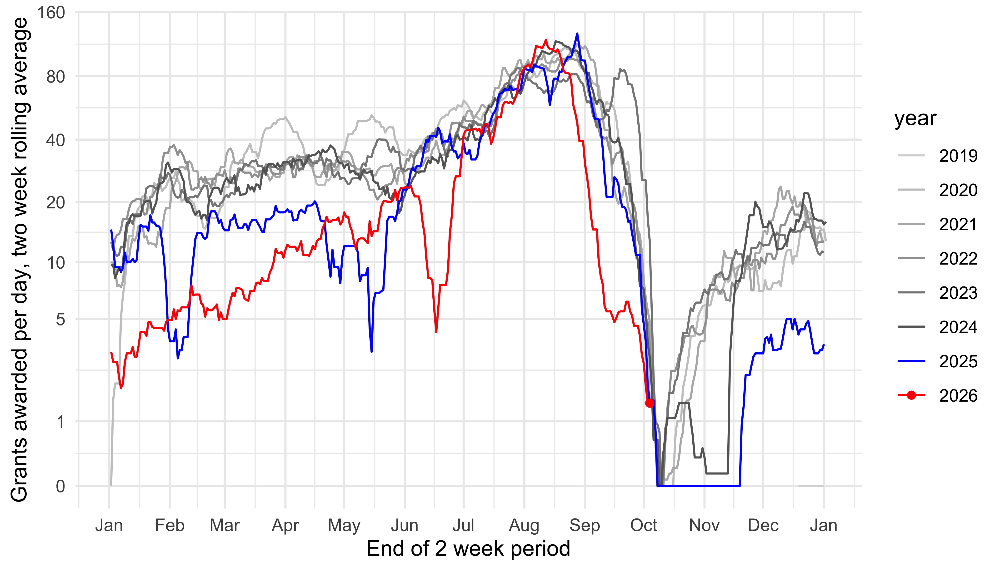
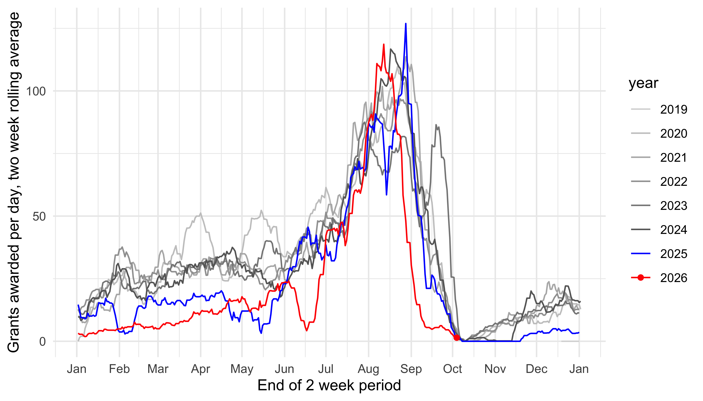
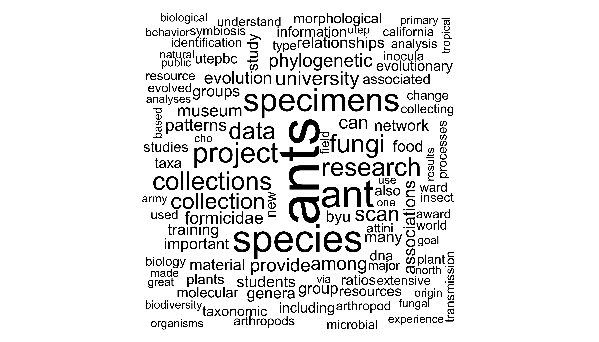
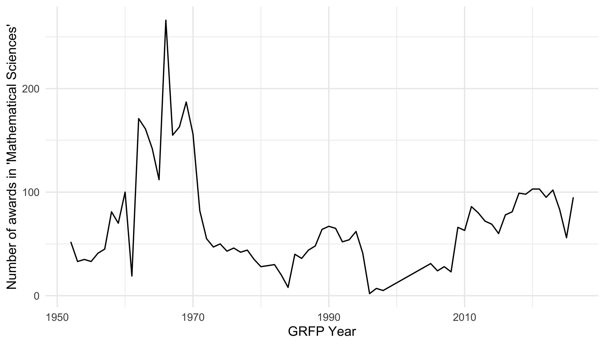

<!-- README.md is generated from README.Rmd. Please edit that file -->

# rnsf

Unofficial package to interface with NSF API

It also has abstracts, dates, and more information for all grants up to
2026-09-23.

- Webpage with package information: <https://bomeara.github.io/rnsf/>
- Github page: <https://github.com/bomeara/rnsf/>

# Installation

**New (Oct 2026)** You can just install this package the way you would
any R package on github:

    remotes::install_github("bomeara/rnsf")

(You’ll need to first install `remotes` (by doing
`install.packages("remotes")`) if you don’t already have it).

Thanks to the [piggyback](https://github.com/ropensci/piggyback)
package, the huge cached files are now stored as releases rather than
within the package, making install easy.

# Usage

There are three main ways to get data:

- Use `rnsf::nsf_return()` with various arguments to pull in data
  directly from NSF’s API for awards. Good if you want to find info by
  keyword, state, or other fields.
  - For example, if we’re curious about grants relevant to Yellowstone
    National Park, we could call
    `rnsf:nsf_return(keyword="Yellowstone")`. It will call the API
    multiple times until it has downloaded info on all grants with that
    keyword and returned a data.frame object.
- Use `rnsf::load_nsf_grants()` to load cached data (available
  [here](https://github.com/bomeara/rnsf/releases/tag/most-recent)) for
  years you specify. By default, it loads cached data from the most
  recent year. Good if you want to do an analysis across thousands of
  grants.
  - If we wanted to look at grants from 2020 to the present, we can call
    `rnsf::load_nsf_grants(year_start=2020)` and it will download the
    cached grants.
  - If we wanted to add any grants
- Use `data(grfp)` after loading the package to load information on all
  the Graduate Research Fellowship Program awards and honorable mentions
  (these are not available from NSF’s API, so I had to download each
  year’s pair of spreadsheets).

Below are some examples of the package’s utility; see
<https://github.com/bomeara/rnsf/blob/master/README.Rmd> for the details
of the code to make the plots.

## Bergograms

Scientist Jeremy Berg often graphs federal funding over time (see
<https://jeremymberg.github.io/jeremyberg.github.io/>). The very useful
website [Grant Witness](https://grantwitness.org) has adopted these
graphs, including invaluable updates of national funding and breakdowns
by NSF division (see, for example,
[here](https://grantwitness.org/nsf/analyses/agency-pulse-nsf-grants)).
With the `rnsf` package we can look at finer detail. For example, the US
Census splits the 50 US states into four different regions: Northeast,
Midwest, South, and West. We can look at funding over time by region
instead of nationally:

Note some important differences between the plots above and those from
Grant Witness: they typically plot by financial year, not calendar year;
they also filter out transfer grants (a grant moves between PIs or
institutions) and the code above does not do that.

## Topic frequency over time

The ozone hole was discovered in
[1985](https://www.usatoday.com/story/news/nation/2025/05/19/what-happened-to-the-hole-in-the-ozone-layer/83644470007/):
pollution led to a depletion of the ozone layer, which shields people
(and other organisms) from a great deal of UV radiation. The world came
together and passed the Montreal Protocol to limit the pollution,
chlorofluorocarbons, that was causing the damage. The hole is healing,
but still requires research and monitoring. We can see how NSF grants
mentioning “ozone hole” changed over time (though not all grants
mentioning “ozone hole” study this issue; some could be using it as a
comparison to some other issue, for example). We can include a
regression before and after 1985 and show the 95% CI for the proportion
in each year (truncated by the y-axis limits).

## Keywords

Let’s look just at awards made in any program with “bio” or
“systematics” or “evolution” in the name (biology grants) and see how
words have changed between those that mention collections-related work
(voucher, collection, field work, fieldwork, specimen) or those that
mention AI (AI, artificial intelligence, LLM, large language model) in
the abstract. First as a proportion of all the grants of either kind:

## Table of award info

We can also look at a table with the number, not total money, of grants
by state or territory by academic semester, for example (only including
this year up to the last cache of the data).

| Area | 2024 Spring | 2024 Fall | 2025 Spring | 2025 Fall | 2026 Spring | 2026 Fall |
|:---|---:|---:|---:|---:|---:|---:|
| California | 508 | 752 | 361 | 586 | 269 | 451 |
| New York | 371 | 475 | 256 | 371 | 160 | 287 |
| Texas | 324 | 415 | 224 | 355 | 140 | 273 |
| Massachusetts | 327 | 410 | 189 | 305 | 127 | 229 |
| Pennsylvania | 243 | 282 | 165 | 233 | 116 | 190 |
| Illinois | 218 | 277 | 122 | 224 | 79 | 132 |
| Virginia | 161 | 227 | 89 | 139 | 69 | 138 |
| Florida | 184 | 225 | 105 | 179 | 101 | 144 |
| Michigan | 208 | 215 | 97 | 188 | 77 | 118 |
| North Carolina | 153 | 210 | 103 | 181 | 71 | 131 |
| Colorado | 111 | 183 | 73 | 146 | 44 | 105 |
| Arizona | 101 | 177 | 65 | 99 | 35 | 92 |
| Georgia | 137 | 171 | 78 | 147 | 57 | 111 |
| Indiana | 130 | 166 | 83 | 157 | 59 | 89 |
| Maryland | 118 | 147 | 79 | 129 | 81 | 106 |
| New Jersey | 123 | 146 | 90 | 138 | 63 | 100 |
| Washington | 97 | 144 | 68 | 106 | 43 | 91 |
| Ohio | 110 | 134 | 73 | 106 | 49 | 92 |
| Tennessee | 78 | 108 | 41 | 83 | 35 | 51 |
| Alabama | 63 | 105 | 51 | 74 | 35 | 90 |
| Wisconsin | 76 | 105 | 64 | 91 | 44 | 72 |
| South Carolina | 60 | 102 | 31 | 66 | 31 | 73 |
| District of Columbia | 51 | 101 | 42 | 55 | 32 | 58 |
| Minnesota | 79 | 101 | 47 | 62 | 27 | 43 |
| Rhode Island | 66 | 84 | 46 | 71 | 47 | 71 |
| Oregon | 68 | 83 | 41 | 65 | 27 | 49 |
| Iowa | 54 | 77 | 36 | 66 | 23 | 60 |
| Louisiana | 54 | 77 | 30 | 68 | 33 | 68 |
| Utah | 44 | 77 | 35 | 65 | 26 | 45 |
| Missouri | 74 | 76 | 64 | 63 | 41 | 62 |
| Connecticut | 66 | 63 | 52 | 66 | 31 | 58 |
| New Mexico | 34 | 62 | 21 | 38 | 21 | 53 |
| Oklahoma | 42 | 59 | 23 | 51 | 26 | 47 |
| Kansas | 29 | 58 | 14 | 34 | 24 | 40 |
| Nebraska | 39 | 55 | 22 | 44 | 14 | 34 |
| Hawaii | 15 | 53 | 16 | 28 | 15 | 32 |
| Kentucky | 36 | 51 | 28 | 40 | 16 | 44 |
| Delaware | 18 | 47 | 31 | 37 | 19 | 37 |
| Idaho | 16 | 43 | 16 | 31 | 14 | 24 |
| Nevada | 12 | 43 | 11 | 31 | 10 | 32 |
| New Hampshire | 21 | 36 | 21 | 35 | 11 | 27 |
| Mississippi | 38 | 35 | 19 | 35 | 10 | 20 |
| Alaska | 10 | 32 | 4 | 19 | 5 | 26 |
| Montana | 19 | 32 | 8 | 22 | 8 | 27 |
| Maine | 30 | 27 | 10 | 24 | 5 | 16 |
| Arkansas | 27 | 25 | 10 | 26 | 13 | 14 |
| West Virginia | 28 | 25 | 8 | 26 | 5 | 17 |
| South Dakota | 20 | 22 | 17 | 17 | 4 | 19 |
| Vermont | 13 | 22 | 12 | 13 | 6 | 17 |
| Puerto Rico | 7 | 20 | 9 | 14 | 3 | 13 |
| Wyoming | 10 | 19 | 7 | 18 | 5 | 7 |
| North Dakota | 11 | 12 | 9 | 21 | 9 | 15 |
| Virgin Islands of the U.S. | 0 | 3 | 1 | 1 | 0 | 1 |
| American Samoa | 0 | 1 | 0 | 0 | 0 | 0 |
| Guam | 0 | 0 | 2 | 1 | 0 | 0 |

## Comparisons by state

We can see how number of awards and total value of awards by state or
territory versus the average so far this year compares to average
funding at this point of the year for 2017-2024 (so it encompasses two
different administrations).

Note that VT had an increase of 288% but was truncated at 179 so that no
change would remain at the center of the plot colors.

## Rolling window

How is NSF awarding grants over time? This uses a two week rolling
interval, showing the average grants awarded per day in that interval.

And rolling window not on a log scale:

## Wordclouds

    #> [1] "Finished first batch"

## GRFP data

The [NSF Graduate Research Fellowship Program](https://www.nsfgrfp.org)
(GRFP) is one of NSF’s oldest and most impactful programs: it provides
funding for three years of study for people in grad school, giving them
flexibility (no need for a research or teaching assistantship); the
stipends are also often higher than those for most grad students. Every
year, names, affiliations, and research areas of awardees (those
receiving the money) and those with honorable mentions are released
[here](https://www.research.gov/grfp/AwardeeList.do?method=loadAwardeeList)
but you can only get one year at a time. I have manually downloaded them
all and incorporated them into the package. To use:

You can then plot information or do other analyses. For example, the
number of awards in Mathematical Sciences over time:

And the frequency of different subfields of math, showing just the first
twenty from the past ten years of awards:

|                                                          |     |
|:---------------------------------------------------------|----:|
| Algebra Or Number Theory                                 | 786 |
| Analysis                                                 | 758 |
| Mathematical Sciences                                    | 539 |
| Topology                                                 | 466 |
| Applications Of Mathematics (Including Biometrics And Bi | 465 |
| Algebra, Number Theory, And Combinatorics                | 359 |
| Applied Mathematics                                      | 239 |
| Probability And Statistics                               | 227 |
| Logic Or Foundations Of Mathematics                      | 172 |
| Geometry                                                 | 139 |
| Statistics                                               | 131 |
| Mathematical Biology                                     |  84 |
| Operations Research                                      |  76 |
| Biostatistics                                            |  70 |
| Computational Mathematics                                |  51 |
| Geometric Analysis                                       |  37 |
| Probability                                              |  31 |
| Computational And Data-Enabled Science                   |  25 |
| Artificial Intelligence                                  |  16 |
| Computational Statistics                                 |  16 |

# Updating the package

First, update the package version in the DESCRIPTION.

Then the directory containing the package source:

    library(rnsf)
    grants_this_year <- nsf_update_cached_this_year() # perhaps worth doing a new nsf_get_all() after the beginning of the year
    devtools::build_readme()
    pkgdown::build_site()
    system("git add */*")
    system("git commit -m'automatic update of page and data' -a --no-verify") # ignore the readme warning
    system("git push")

If new GRFP results are out, download them, retitle them as Awardee or
HonorableMention with year and .tsv (i.e., “Awardee2030.tsv”) and put
them in the inst/extdata directory in the package source. Reinstall the
package. Then,

    library(rnsf)
    grfp <- compile_grfp()
    usethis::use_data(grfp, overwrite=TRUE)

Then do the usual git things.
